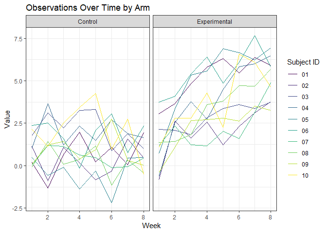

HW 5
================
Christopher Crowe
November 3, 2018

### Problem 1

The below code chunk reads in all of the data for each of the study participants and stores the data in a tidy way.

``` r
path = list.files("./hw5_data/data", full.names = TRUE)

datafiles = 
  tibble(
  arm =  str_detect(path, "con"),
  participant = str_extract(path, "\\d+(?=.csv)"),
  data = map(.x = path, ~read.csv(.x))
  )

datafiles =
  datafiles %>% 
  unnest %>% 
  mutate(arm = case_when(arm == TRUE ~ "Control",
                         arm == FALSE ~ "Experimental")
  ) %>% 
  gather(key = "week", week_1:week_8, value = "value") %>% 
  mutate(week = as.numeric(str_extract(week, "\\d"))) %>% 
  arrange(arm, participant)

datafiles
```

    ## # A tibble: 160 x 4
    ##    arm     participant  week value
    ##    <chr>   <chr>       <dbl> <dbl>
    ##  1 Control 01              1  0.2 
    ##  2 Control 01              2 -1.31
    ##  3 Control 01              3  0.66
    ##  4 Control 01              4  1.96
    ##  5 Control 01              5  0.23
    ##  6 Control 01              6  1.09
    ##  7 Control 01              7  0.05
    ##  8 Control 01              8  1.94
    ##  9 Control 02              1  1.13
    ## 10 Control 02              2 -0.88
    ## # ... with 150 more rows

The below code chunk creates a spaghetti plot of the observations on each subject over time by arm.

``` r
datafiles %>% 
  ggplot(aes(x = week, y = value, color = participant)) +
    geom_line() +
    facet_grid(~arm) +
    viridis::scale_color_viridis(
      discrete = TRUE,
      name = "Subject ID"
    ) +
    labs(
      x = "Week",
      y = "Value",
      title = "Observations Over Time by Arm"
    ) +
    theme_bw()
```



From this plot, we can see that the observed values for subjects in the experimental group tended to increase over time, while those for the control group were relatively constant over time.

### Problem 2

The below code chunk reads in the data and describes the raw data.

``` r
homicides = read.csv("./hw5_data/homicide-data.csv")

homicides %>%
  nrow()
```

    ## [1] 52179

``` r
homicides %>% 
  ncol()
```

    ## [1] 12

``` r
homicides %>% 
  select(victim_first) %>% 
  head(1)
```

    ##   victim_first
    ## 1         JUAN

``` r
homicides %>% 
  select(victim_last) %>% 
  head(1)
```

    ##   victim_last
    ## 1      GARCIA

``` r
homicides %>% 
  select(victim_age) %>% 
  head(1)
```

    ##   victim_age
    ## 1         78

``` r
homicides %>% 
  select(city) %>% 
  head(1)
```

    ##          city
    ## 1 Albuquerque

``` r
homicides %>% 
  select(state) %>% 
  head(1)
```

    ##   state
    ## 1    NM

``` r
homicides %>% 
  select(disposition) %>% 
  head(1)
```

    ##             disposition
    ## 1 Closed without arrest

``` r
homicides %>% 
  select(victim_age) %>% 
  summarize(round(mean(as.numeric(victim_age)), digits = 0))
```

    ##   round(mean(as.numeric(victim_age)), digits = 0)
    ## 1                                              33

The `homicides` dataset contains data related to homicides in major U.S. cities. The dataset reports information on each homicide across 12 columns and 52179 rows. Variables include key pieces of information for each case, such as the victim's first name, last name, and age as well as the location of status of the case. For example, the first record in this dataset provides information on the homicide of JUAN GARCIA who was 78 years old. He lived in Albuquerque, NM, and his case was "Closed without arrest." Additionally, a preliminary analysis shows that the average age of all victims in this dataset was 33.

### Problem 2

The below code chunk creates a new variable, `city_state`, which concatenates the `city` and `state` variables.

``` r
homicides = 
  homicides %>% 
  mutate(city_state = paste(city, state, sep = ", ")) %>% 
  select(-city, -state)
```

The below code chunk creates a new datafram that contains counts of the number of total homicides for all homicides as well as unsolved homicides in each city.

``` r
total_homicides = 
  homicides %>% 
  group_by(city_state) %>% 
  summarize(all_homicides = n(),
            unsolved_homicides = sum(disposition == "Closed without arrest" | disposition == "Open/No arrest"))
```
